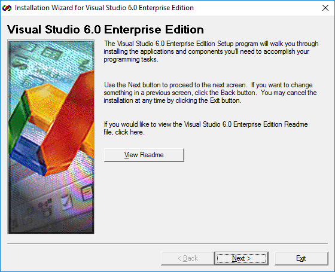

# Install Visual Studio 6.0 on Windows 10

[Kirk Stowell]

4.95/5 (78 votes)

8 Jun 2017 

A tutorial for installing Visual Studio 6.0 on Windows 10

This article is a step by step process to install Visual Studio 6.0 on Windows 10. This article references the Enterprise edition of Visual Studio; however the same approach should work with the Professional version as well. It goes over how to clean up previous attempts if you've tried installing and failed, goes through running the setup wizard, and tells you which settings to disable.

## Introduction

Yes, you read that title correctly, this article describes how to install Visual Studio 6.0 on Windows 10. Visual Studio 6.0 is still widely used around the globe, and there is a need to provide support for legacy applications and developers who still want to use this platform. Also, being the old timer that I am, I still like using Visual Studio 6.0 whose interface was specifically designed for C++ development. Sure, I admit I might be a little resistant to change, but I also find the MFC wizards are more C++ friendly and I like the ability to record macros which was no longer supported with newer versions of Visual Studio.

I have read several articles on this subject, most are good but seem to be incomplete or missing one or two key elements. I wanted to document what I have discovered through trial and error to be the best approach for installing Visual Studio 6.0 on later versions of Windows without the need for a 3rd party tool or installer.

## Clean Up Previous Attempts

If you are reading this article, you have no doubt already attempted to install Visual Studio 6.0 on Windows 10 already and it has failed. If this is the case, you will need to do some manual cleanup first before we get started. Follow these steps to manually clean up any previous installation attempts:

### Delete Installation Folders

You will need to remove any installation folders from previous installation attempts, they are usually located under _C:\\Program Files (x86)_ folder for 64-Bit OS and _C:\\Program Files_ folder on 32-Bit OS. **Note**: If you have installed Visual Studio 2017, make sure you do not touch the _C:\\Program Files (x86)\\Microsoft Visual Studio\\2017_ folder.

*   _C:\\Program Files (x86)\\Microsoft Visual Studio\\Common_
*   _C:\\Program Files (x86)\\Microsoft Visual Studio\\MSDN_
*   _C:\\Program Files (x86)\\Microsoft Visual Studio\\MSDN98_
*   _C:\\Program Files (x86)\\Microsoft Visual Studio\\VB98_
*   _C:\\Program Files (x86)\\Microsoft Visual Studio\\VC98_
*   _C:\\Program Files (x86)\\Microsoft Visual Studio\\\*.HTM_
*   _C:\\Program Files (x86)\\Microsoft Visual Studio\\\*.TXT_
*   _C:\\Program Files (x86)\\Common Files\\Microsoft Shared\\MSDesigners98_
*   _C:\\Program Files (x86)\\Common Files\\Microsoft Shared\\MSDN_
*   _C:\\Program Files (x86)\\Common Files\\Microsoft Shared\\VS98_
*   _C:\\Program Files (x86)\\Common Files\\Microsoft Shared\\Wizards98_

### Remove Registry Entries

You will need to run _regedit.exe_ and delete the following keys if they exist:

*   _HKEY\_LOCAL\_MACHINE\\Software\\Microsoft\\DevStudio_
*   _HKEY\_LOCAL\_MACHINE\\Software\\Microsoft\\HTML Help Collections_
*   _HKEY\_LOCAL\_MACHINE\\Software\\Microsoft\\MSVSDG_
*   _HKEY\_LOCAL\_MACHINE\\Software\\Microsoft\\Visual Basic\\6.0_
*   _HKEY\_LOCAL\_MACHINE\\Software\\Microsoft\\Visual Component Manager_
*   _HKEY\_LOCAL\_MACHINE\\Software\\Microsoft\\Visual Modeler_
*   _HKEY\_LOCAL\_MACHINE\\Software\\Microsoft\\VisualStudio\\6.0_
*   _HKEY\_LOCAL\_MACHINE\\Software\\Wow6432Node\\Microsoft\\DevStudio_
*   _HKEY\_LOCAL\_MACHINE\\Software\\Wow6432Node\\Microsoft\\HTML Help Collections_
*   _HKEY\_LOCAL\_MACHINE\\Software\\Wow6432Node\\Microsoft\\MSVSDG_
*   _HKEY\_LOCAL\_MACHINE\\Software\\Wow6432Node\\Microsoft\\Visual Basic\\6.0_
*   _HKEY\_LOCAL\_MACHINE\\Software\\Wow6432Node\\Microsoft\\Visual Component Manager_
*   _HKEY\_LOCAL\_MACHINE\\Software\\Wow6432Node\\Microsoft\\Visual Modeler_
*   _HKEY\_LOCAL\_MACHINE\\Software\\Wow6432Node\\Microsoft\\VisualStudio\\6.0_
*   _HKEY\_CURRENT\_USER\\Software\\Microsoft\\DevStudio_
*   _HKEY\_CURRENT\_USER\\Software\\Microsoft\\MSVSDG_
*   _HKEY\_CURRENT\_USER\\Software\\Microsoft\\Visual Basic\\6.0_
*   _HKEY\_CURRENT\_USER\\Software\\Microsoft\\Visual Modeler_
*   _HKEY\_CURRENT\_USER\\Software\\Microsoft\\VisualFoxPro_
*   _HKEY\_CURRENT\_USER\\Software\\Microsoft\\VisualStudio\\6.0_

## Prepare Setup Files

First, you are going to need a copy of **Visual Studio 6.0** setup files. I am going to assume that you have obtained or own a legal licensed copy of this already. This article references the **Enterprise** edition of Visual Studio; however the same approach should work with the **Professional** version as well, now let's begin.

### Step 1

You will to need to create a folder either on your desktop or some other location that we can use to copy the installation files to. The reason for this is some of the files will need to be modified or edited. Let's create a folder on your desktop and call it _Setup_. Go to your installation CD and copy the contents to this folder. If you have multiple CDs, copy each one starting with the first one to the _Setup_ folder, you can skip over files with duplicate names when prompted to overwrite.

### Step 2

Edit the file called _SETUPWIZ.INI_ and under the section called **\[setup wizard\]**, change the entry for **VmPath=ie4\\msjavx86.exe**. If this entry does not exist, you can skip this step. We need to remove the value **ie4\\msjavx86.exe** form this entry so it will create an empty environment variable during installation. This will stop the setup wizard from looking for and installing this very old version of MS Java on our system. After removing this entry, your INI file entry should now look like this:

### Step 3

Go to the _Setup_ folder we created on our Desktop and locate the file _SETUP.EXE_. Right click on this file and choose **Properties**. Select the **Compatibility** tab and check to box **Run this program in compatibility mode for:** and set the value to **Windows XP (Service Pack 3)**. Also make sure you check the box **Run this program as an administrator** and press the **Apply** button. You can also use the Service Pack 2 option, either setting should work.

## Run Setup Wizard

Now we should be ready to begin the installation. From our _Setup_ folder on the Desktop, right click on _SETUP.EXE_ and choose **Run as administrator**. Once the Setup dialog is displayed, choose all the defaults for each step until you reach the Visual Studio 6.0 Enterprise Setup dialog, then press the **Continue** button. Setup will search the system for previously installed components. Once this process has completed (it may take a while depending on your system), you will be presented with a dialog to choose the installation type, select the **Custom** setup option to continue. This is where things will vary depending on what version you are installing - Professional or Enterprise. The screens shots below are from the Enterprise edition. If you are prompted about installing Source Safe, choose the **NO** option to continue.

### Custom Settings

At this point, you should see the **Visual Studio 6.0 Enterprise - Custom** dialog. For this article, we are only installing Visual Basic 6.0 and Visual C++ 6.0, so you can uncheck the options for Visual FoxPro 6.0, Visual InterDev 6.0 and Visual SourceSafe 6.0. Now select the option for Visual C++ 6.0 and press the **Change Option...** button to install the UNICODE libraries for MFC.

### Install Unicode Libraries

Although this part is optional, most modern applications need to provide support for multiple languages and you will need this option if you plan on supporting languages such as Chinese, Japanese or Arabic. When presented with the next dialog, select the option **VC++ MFC and Template Libraries** and press the **Change Option...** button, then select the option **MS Foundation Class Libraries** and press the **Change Option...** button. Here, we will want to install everything listed so press the **Select All** button to choose all the options, you should now see the following options:

Press the **OK** button to continue. Keep pressing the **OK** button until we get back to the **Visual Studio 6.0 Enterprise - Custom** dialog.

### Disable ADO, RDS and OLE DB Providers

Select **Data Access** and press the **Change Option...** button. When the Data Access dialog opens, select the ADO, RDS and OLE DB Providers setting and make sure it is unchecked. You will see a message that says the component is an essential part of the application, you can ignore this warning and press the **OK** button. Leaving this option checked will cause the installation to fail on Windows 10.

### Disable Visual Studio Analyzer

The last setting we need to disable is the Visual Studio Analyzer. Leaving this option checked will cause the installation to fail. To disable this, select the **Enterprise Tools** option and press the **Change Option...** button. Uncheck the option for Visual Studio Analyzer on the Enterprise Tools dialog and press the **OK** button to continue.

### Finish Installation

Now we are ready to start the installation, press the **Continue** button to begin. When presented with the **Setup Environment Variables** dialog, just leave the Register Environment Variables box unchecked and press the **OK** button to continue. The installer should now be running and installing files onto your hard drive. Once completed, you will be asked to overwrite JIT Settings, select **No** to continue. You should now see a **Restart Windows** dialog indicating your installation was successful. Close any open applications and press the **Restart Windows** button to continue your installation.

You will be prompted to install MSDN once Windows restarts, follow the prompts to complete the installation.

## Install Service Pack 6

Once you have successfully installed Visual Studio 6.0, you should install the latest Service Pack which is Service Pack 6. As of the writing of this article, you could still download SP6 from Microsoft's website, **[click here](https://www.microsoft.com/en-us/download/details.aspx?id=9183)** for more details. Extract the files to a folder on your Desktop, and right click on the file _SETUPSP6.EXE_ follow the same steps we did under Step 3 for _SETUP.EXE_ and change compatibility to Windows XP (Service Pack 3), and run the executable as Administrator. Follow the prompts to complete the installation.

Once completed, again follow the steps outlined in Step 3 above and double check the compatibility mode for the _.exe_ files located in _C:\\Program Files (x86)\\Microsoft Visual Studio\\Common\\MSDev98\\Bin\\_ and make sure they are set to Windows XP compatibility. Visual Studio 6.0 Enterprise edition is ready to use.

## Program Compatibility

If you see the **Program Compatibility Assistant** dialog open when you first run Visual Studio 6.0, you can check the box that says **Don't show this message again** and press the **Run the program without getting help** button. You should no longer see this message when you run Visual Studio 6.0.

## Debugging

If your application hangs or crashes when you step through your code while debugging, select **Tools** from the drop menu in Visual Studio 6.0, then **Options** to open the Options dialog. Select the **Debug** tab and uncheck the **OLE** **RPC debugging** and **Debug commands invoke Edit and Continue** options and restart Visual Studio 6.0. You should now be able to step through your code without any problems.

## Useful Add Ons

Visual Studio 6.0 had some useful add on programs that you could install to make the user interface a better experience, I have listed a few of them here below. As of the writing of this article, you could still download these tools from **[wndtabs.com](http://www.wndtabs.com/)**.

### WndTabs

Provides and file management for the Visual C++ 6 editor

### Spelly

Smart spell-checker for Visual Studio

### Line Counter

Easily count source code lines in your Visual Studio projects

## Closing Notes and Credits

I would like to give credit to the following articles for providing information on cleaning up failed Visual Studio 6.0 installations and preventing old MS Java installation from starting:

*   [How to install Visual Studio 6 onto Windows 10](http://it.toolbox.com/blogs/locutus/how-to-install-visual-studio-6-onto-windows-10-70155)
*   [Installing Visual Basic/Studio 6 on Windows 10](http://blog.danbrust.net/2015/09/14/installing-visual-basic-studio-6-on-windows-10/#.WUhzTGjyuUl)

If you have any additional comments or tips that would make this article more helpful, please let me know, otherwise thanks for reading and I hope you found this information useful.

## History

*   8th June, 2017: Initial version

## License

This article, along with any associated source code and files, is licensed under [The Code Project Open License (CPOL)](../license.md)
  
 

Article Copyright 2017 by Kirk Stowell
Everything else Copyright © **CodeProject**, 1999-2024
  
Web01 2.8:2024-10-20:1